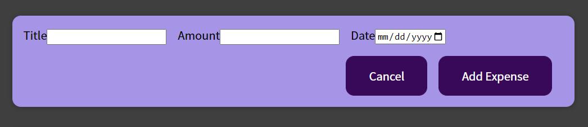
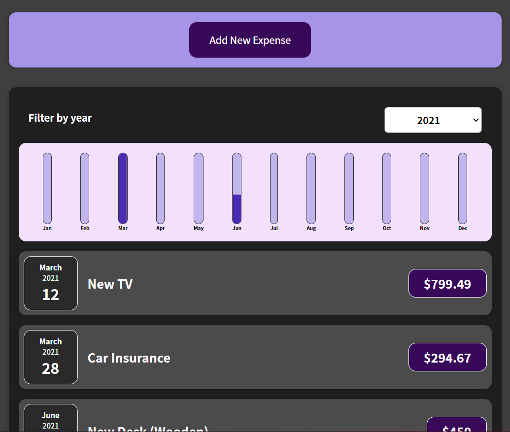

# Expense Tracker

* Created with React and Functional components

# How to set up this project

* Clone this repository to your desktop

* Open project in command prompt or preferred terminal

* Once the project is open, run `npm install` to install dependencies

* Once installed, run `npm start`

# How it can be used

* Can add a new expense by clicking the "Add New Expense" button at the top of the page to open the form

* Enter the title of the expense, the amount, and the date

* Once added, an expense if listed below

* The expenses list can be filtered by year

* The chart bar displays the amount spent per month in height which is dependent upon the total spent during that month (changes when new expenses are added)

